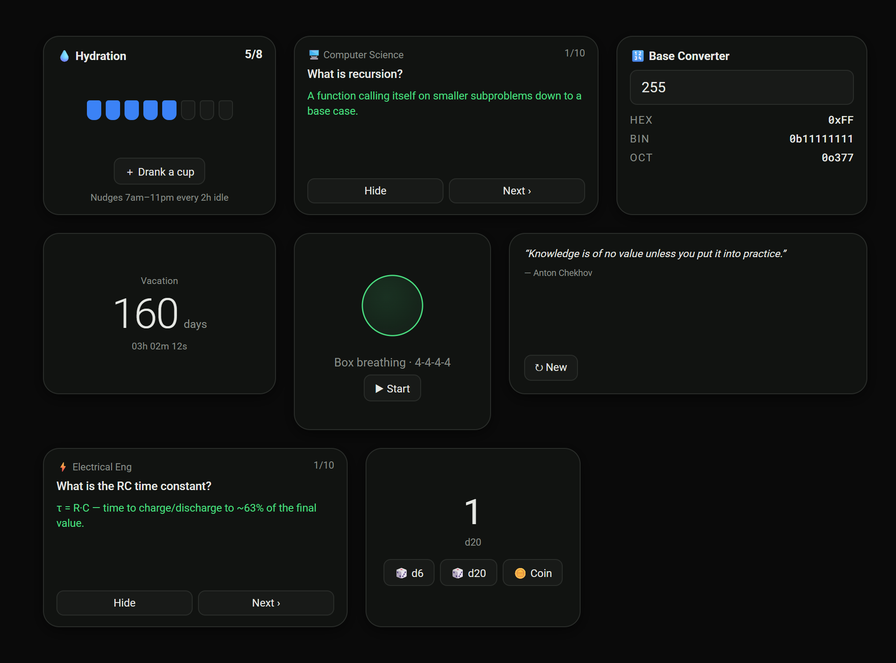

# 🧠 DJBoard

A self-hosted, MindChuk-inspired note & project board. One lightweight Node.js
server, zero database service, dark-mode-first design — built to run on a
Raspberry Pi, a home-lab Docker host, or your laptop.


## Features

**Notes**
- Masonry card board with created / edited timestamps on every card
- Tags with colors — quick-filter bubbles under the search bar, pinnable tags
- Full-text search across titles, note text, checklist items and tag names
- To-do lists inside notes with checkboxes and progress counters
- Image attachments (uploaded and stored server-side)
- Colored note outlines + per-note text color
- Pin notes to a dedicated section at the top of the board
- Right-click context menus (pin, recolor, remind, edit, delete)

**Widgets** — drag-and-drop dashboard widgets, freely positionable and resizable
- ✍️ **Whiteboard** — full-screen handwriting canvas, optimized for iPad +
  Apple Pencil (pressure-sensitive ink, palm rejection, pen/highlighter/eraser,
  undo/redo, 9 colors)
- 🕐 **Clock** — big local time plus world-clock rows for cities you choose
- ⏱ **Timer** — scroll-wheel adjustable HH:MM:SS, named timers, presets,
  progress ring
- 📅 **Calendar** — month grid with today highlighted, days-left-this-year ring,
  dot markers on days that have reminders
- 🌤 **Weather** — Open-Meteo powered (no API key needed), city search, °F/°C
- ⏰ **Reminders** — quick standalone reminders with once/hourly/daily/weekly
  recurrence
- 📖 **Word of the Day** — a built-in vocabulary set with definitions and
  examples; a new word daily, mark words as learned
- 🎴 **Flashcards** — language decks (Spanish, French, German, Italian,
  Japanese) with tap-to-flip and shuffle
- 🍅 **Pomodoro** — focus/break cycles with a progress ring and daily
  session count
- 🧩 **Memory Trainer** — a digit-span brain-training game that grows with you
  and tracks your best score
- 🔥 **Habits** — daily habit checklist with automatic streak counting
- 💧 **Hydration** — tap to log a cup of water, tracks your daily goal
- 💻 🔌 ➗ ⚡ 🖥️ **Knowledge quizzes** — flip-to-reveal Q&A decks for
  Programming, Computer Engineering, Mathematics, Electrical Engineering, and
  Computer Science
- ⏳ **Countdown** — live days/hours/minutes to any event you set
- 🌬️ **Breathing** — animated box-breathing coach for a quick focus reset
- 💭 **Quote** — a daily dose of motivation
- 🎲 **Dice & Coin** — quick d6/d20 roller and coin flip
- 🔢 **Base Converter** — decimal ↔ hex / binary / octal, handy for dev work




**Reminders**
- Attach reminders to notes (date, time, frequency) or create standalone ones

**UI**
- Dark & light mode, remembered per device
- Font switcher: Roboto, Roboto Mono, Courier
- Responsive mobile layout with auto-detection + manual 📱/🖥 override
- 📺 **Display mode** — a read-only page that auto-refreshes every 5 minutes
  with Today / This Week / This Month / All filters, made for wall-mounted
  tablets and status screens

More screenshots and walkthrough demos live in [`/design`](design/).

## Quick start

```bash
git clone https://github.com/tjbmoose09/mindboard.git
cd mindboard
npm install
npm start
```

Open http://localhost:3113. That's it — data lives in `./data/db.json`,
uploads in `./data/uploads/`.

### Environment variables

Copy `.env.example` to `.env` and fill in what you need — it's loaded
automatically on start (no need to `export` anything by hand).

| Variable | Default | Purpose |
|---|---|---|
| `PORT` | `3113` | HTTP port |
| `DATA_DIR` | `./data` | Where notes, uploads and settings are stored |
| `AUTH_PASSWORD` | *(unset)* | Requires this password to use the board — see [Security notes](#security-notes) |
| `SESSION_SECRET` | *(random each boot)* | Signs the session cookie; set this so logins survive a restart |
| `COOKIE_SECURE` | *(unset)* | Set to `1` if DJBoard is served over HTTPS |

## Docker

```bash
docker build -t djboard .
docker run -d --name djboard \
  -p 3113:3113 \
  -v djboard_data:/app/data \
  djboard
```

Or with compose:

```yaml
services:
  djboard:
    build: .
    container_name: djboard
    restart: unless-stopped
    ports:
      - "3113:3113"
    volumes:
      - djboard_data:/app/data
volumes:
  djboard_data:
```

## Raspberry Pi + TV kiosk

Want DJBoard running on a Pi with a TV showing the auto-refreshing, read-only
board? See [`deploy/`](deploy/) for a systemd unit plus a kiosk boot script.

## Security notes

- DJBoard is single-user. Set `AUTH_PASSWORD` (and ideally `SESSION_SECRET`,
  so sessions survive restarts) to require a login before the board or its
  API can be used — see `.env.example`. Leave `AUTH_PASSWORD` unset to run
  with no login at all, e.g. if you're relying on a VPN (Tailscale/WireGuard)
  or an authenticating reverse proxy instead.
- If you expose DJBoard beyond a trusted network, also set `COOKIE_SECURE=1`
  and put it behind HTTPS (a reverse proxy doing TLS termination is fine) —
  otherwise the session cookie can be intercepted.
- The `data/` directory contains all of your notes and uploaded images. It is
  gitignored for a reason — never commit it.

## Tech

Vanilla JS + CSS front end (no framework, no build step), Express + Multer on
the back end, JSON file storage with atomic writes. The whiteboard uses pointer
events with coalescing and pressure support; widget text scales with CSS
container queries.

## License

[MIT](LICENSE)
